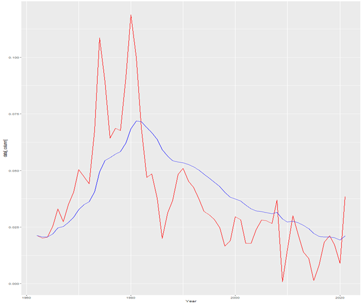

# Insurance Scheme for Climate-Related-Displacement in Storslysia (Team Autogroup)

Team Members: Aditeya Sharma, Eagan Jiang, Jim Liu, Michael Wang

## Table of Contents 

1. [Executive Summary](#executive-summary)
2. [Program Design](#program-design)
    - [Requirements and Objectives](#requirements-and-objectives)
    - [Coverage and Structure](#coverage-and-structure)
        - [Triggers](#triggers)
        - [Features](#features)
        - [Budget and Payments](#budget-and-payments)
3. [Model Development](#model-development)
    - [Exploratory Data Analysis](#exploratory-data-analysis)
        - [Summary of Dataset](#summary-of-dataset)
        - [Data Limitations and Cleaning](#data-limitations-and-cleaning)
        - [Preliminary Data Exploration](#preliminary-exploratory-data-analysis)
    - [Assumptions](#assumptions)
    - [Risk and Risk Mitigation Strategies](#risk-and-risk-mitigation-strategies)
    - [Final Modelling](#final-modelling)
4. [Scheme Evaluation](#scheme-evaluation)
    - [Pricing/Costs](#pricingcosts)
    - [Comparison](#comparison)
5. [Conclusion](#conclusion)

## Executive Summary
Team Autogroup has been approached by an interdisciplinary task force from the Government of Storslysia (“the Task Force '' henceforth) for consultation services.

Due to global climate trends, catastrophic weather events are increasing in frequency and severity. The Task Force seeks to manage the catastrophe-related risk posed to Storslysian citizens by these events through a social insurance program, to cover the costs associated with displacement. Team Autogroup has been engaged to design this scheme, and provide a quantitative evaluation of its projected economic benefits.

## Program Design

### Requirements and Objectives
The proposed social insurance scheme has two key objectives: 
1. Reduce the exposure of households to catastrophe-related displacement costs.
2. Reduce the overall costs arising from such events for the Storslysian Government with a high degree of certainty (95% CI).

In addition, the Task Force has also provided several requirements and constraints:
- Coverage must extend to the entire Storslysian population, although benefits can vary by geographic and socio-economic status.
- The program must cover both emergency relocation following an event, and voluntary proactive relocation at other times.
- Funding, emergency response and infrastructure costs are out of the project’s scope, only displacement/relocation costs will be covered by this program.
- Labour and material costs may legally increase by 0% - 50% following catastrophic events, due to increased demand.
- The annual cost of the program should not exceed 10% of GDP (95% CI).
In light of the above, it is clear that costs can be greatly reduced by encouraging proactive relocation. Furthermore, the budget constraint means that certain claims will have to be prioritised based on immediate risk. These considerations will be explored in further sections. 

### Coverage and Structure
The following scheme is proposed, to satisfy the project requirements and objectives:

#### Triggers
Claims are classified into two types based on their trigger:
- Emergency Claim (“EC” henceforth), can only be triggered when a household is affected by a catastrophic weather event.
- Proactive Claim (“PC” henceforth), can be triggered at any time, but will be added to a waitlist rather than immediate payout (pending scheme budget). 

#### Features 
All citizens are eligible for basic coverage, which includes the following:
Relocation costs (transport)
- Cost of temporary accommodation for fixed period
- Damage/loss of personal Items
Residents may also be eligible for additional coverage/features:

| Criteria | Benefit/Restrictions|
|:---|:---|
| Occupancy Status | Owner-Occupied:   - Basic Coverage   - IF property is partially damaged, cost of repairs   - IF property is total loss, purchase/construction of equivalent property   Tenant-Occupied:   - Tenant receives Basic Coverage   - Landlord receives no benefit |
| Region | High-Risk Region:   - Eligible for both PC and EC    - Households can only be relocated to low-risk regions   Standard Region:   - Only EC can be made   - Can only be relocated within the same region |

#### Budget and Payments
- Only one claim is allowed per household, per event. 
- Gross claims payments will be capped at either 10% GDP or predetermined proportion of projected costs without scheme (whichever is lower, 95% CI)
- Catastrophe-related claims have priority each year. The remainder of the monthly budget will then be assigned to proactive relocation claims. 
- Claims payment budget will be divided between Regions proportionally to risk.

## Model Development

### Exploratory Data Analysis

#### Summary of Dataset 

| Name | Description |
|:---|:---|
| Hazard Data | List of historical hazard events in Storslysia and related hazard-specific information |
| Demographic-Economic | Historical census and economic data by region of Storslysia |
| Inflation-Interest | Historical Storlysia inflation and interest rates |
| SSP Scenarios | Projections of CO2 emissions, world population and other economic factors |
| Model | Frequency projection of hazard event severity and counts based on SSP Scenarios |

#### Data Limitations and Cleaning 
A key limitation was insufficient depth of data. Hazard-specific information was limited to injuries, fatalities and property damage. This restricted our use of more distinct modelling such as event-type specific modelling.

Another case of poor data quality arises from hazard event categorisation. Hazard events are categorised into 51 categories, a breakdown that is too sparse. For example, there is no reason Tornado and Tornado/Wind should not be combined. Thus, a reclassification of the data was performed based on the greatest contributing factor.

Within the Inflation - Interest dataset, there is both missing and incorrect data. The bank lending rate for 1987 is missing, the 1-year risk free rate has been imputed with “#N/A” and the inflation rate over 2003 is -990.00%, a value outside of reasonable bounds. 

#### Preliminary Exploratory Data Analysis
After data was manipulated and cleaned, summary statistics were collated to examine regional and time-based differences.

Region 2 and 3 had the highest frequency of events. However, Region 6 had the greatest number per capita, due to its low population, despite having the least events. The highest average fatalities per event also belonged to Region 2. When corrected for population size, again Region 6 is the highest due to the low population. 

The region with the highest average property damage per event was Region 2, twice that of Region 5, which itself was more than three times the third highest, Region 4. There are potentially outlier effects, with the highest property damage event being more than double the second highest. However, due to Region 2 having five of the six costliest events, each occurring over significantly different time periods, no observations were removed for this reason. Furthermore, when removing the top 10% of property damage observations, Region 2 still remained the region with highest gross costs.

Based on the significant and consistent differences in risk observed between each region, it was decided that each region would be modelled independently. 

Afterwards, seasonality and time effects were looked at. Of the 3366 observations, 1208 of them occurred in quarter 2 while only 401 occurred in quarter 4. Quarter 1 and 3 were both between them, showing clear seasonality in accident trends. To avoid issues with month-to-month seasonality, it was decided to model claims annually as an aggregate damage/claim amount rather than individual severity and frequency.

When looking at trends across a longer time horizon, it was noted that the years with the highest number of events were all in the recent past, with the top four all being post-2010. The general increase in event frequency can be seen in Figure 1. Figure 2 examines average severity. Before 1989, the graph was relatively flat. However, the average severity spikes far more frequently in following years, indicating severely destructive events have become more common.

  
    Figure 1: Count of Disastrous Events Per Year

  
    Figure 2: Average Severity of Disastrous Events Per Year

These seasonal and time effects were also accounted for in our modelling of region-specific hazard event frequencies and severities.

### Assumptions
For the final model, some assumptions had to be made for practical reasons (model understandability, computational efficiency, etc). Key assumptions include:
- No IBNR claims; all claims are submitted during the period they are incurred.
- Demand for Proactive Claims always exceeded supply; the maximum amount within the annual scheme budget is always paid out.
- Constant real GDP; The GDP reported for 2020 was also applied to all future years, albeit adjusted for inflation.
- An autoregressive model is appropriate for forecasting both hazards and economic indices, using their provided time series data.

### Risk and Risk Mitigation Strategies

| Risk Category | Risk | Description | Mitigation Strategy |
|:---|:---|:---|:---|
| Financial: Underwriting Risk | Policyholder Behaviour | Policyholders not taking sufficient precaution after a few years of purchasing the Insurance. | Encouraging people to take more cautionary measures to protect the property and themselves from injury by giving them better incentives such as lower premium and organising yearly house inspections to spread awareness. |
| Financial: Market Risk | Concentration | Losses caused due to high investment in geographical areas of high mortality. | Advising people against purchasing houses in higher risk geographical areas. |
| Financial: General Insurance Risk | Model Risk | Climate and weather-related events are subjected to a high degree of uncertainty making their estimation incredibly difficult. | Making assumptions more reasonable by comparing them constantly with the updated weather/climate data. |
| Non-Financial: Market Risk | Political Risk | New political parties in parliament can have different preferences regarding the coverage and necessity of the Insurance pool. | This can only be retained as ultimately the parliament is responsible for making final decisions in coverage and necessity of the insurance pool. |

### Final Modelling

An autoregressive integrated moving average (ARIMA) model was fitted to the economic and property damage data to forecast the future costs for the next 20 years. 

When modelling the various economic rates, the data fluctuates heavily year-on-year as seen in Figure 3, causing predictions that were inconsistent with historical data. Consequently, an exponentially weighted moving average (EWMA) was implemented to smooth out the curve, shown in blue by increasing the weight of more recent data.

  
    Figure 3: Forecast with and Without Exponential-Weighted Moving Averages

The ARIMA model was then fitted to the EWMA data. An ARIMA model incorporates three parameters: p, the number of previous terms to take into account, d, a term to remove seasonality, and q, the number of terms to take into account for a moving average. The parameters selected were optimised to best fit the forecast. An example forecast (inflation rate) with confidence interval is provided on the right. The regional property damage was much more volatile and sparse, and a similar smoothing and forecasting process was used to achieve similar results.

  
    Figure 4: Forecasts From ARIMA Model (1,2,2)

This model was applied to each region to forecast the gross annual hazard cost. Using the equivalence principle for premium calculation, these annual costs also correspond to the expected payout of a scheme with only Emergency Claims. To generate forecasted costs of the final scheme with Proactive Claims, the Emergency Claim estimates were adjusted in Regions 2 and 3 to account for the reduced risk exposure year-on-year resulting from households that had proactively relocated. Using a recurring sum for each year yielded the final claim cost forecast for the complete scheme.

## Scheme Evaluation

### Pricing/Costs
Our model produced the following NPV of forecasted scheme cost across a 20-year time horizon:
> npv_scheme   [1] Ꝕ 1,212,510,589

### Comparison
Without the scheme in place, the following 20-year NPV was forecasted
> npv_noscheme   [1] Ꝕ 4,841,946,104

## Conclusion

After conducting our research, Team Autogroup strongly advises the Task Force to implement the coverage and structure outlined in this report. This scheme addresses and meets the requirements of the requested deliverables, and possible risks and mitigation strategies have also been discussed in depth. Furthermore, the scheme is projected to be NPV positive in a 20-year time horizon, with significant margin for unanticipated events. Therefore, Team Autogroup believes that this program will be a stable and cost-effective method to aid Storslysia in its management of displacement risk arising from catastrophic events.